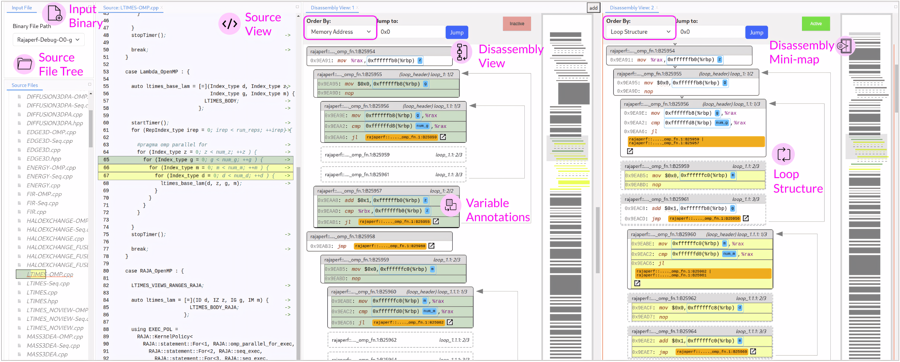

# Interactive Visualization of Binary Code for Investigating Compiler Optimizations

This project visualizes binary executable files and maps it back to the source code. I used the Dyninst library that can decompile binary files compiled with Debug flags. The implementation details are listed below.

__Figure: Overview of the Binary Visualization Tool, DisViz shows source-to-assembly correspondence.__



__The demonstration of the tool, DisViz is shown in the video link below.__

## [Video Link](https://youtu.be/RVfb3yhSeI4)

## Quick Start

To run the project, you can either use the recommended Docker image or build and run it locally.

### Run in a Docker
Ensure your Docker is installed with the proper permissions. To install Docker, follow the [official documentation](https://docs.docker.com/engine/install/). After you have Docker set up, run the following command:

```bash
cd dis-viz 			                      # cd into root of the project
docker build -t dis-viz .  		      	# build the docker from Dockerfile
docker run -p 8080:8080/tcp dis-viz  	# run the docker at port 8080
```

### Run on Local machine

1. [Install crow.cpp](https://crowcpp.org/master/) and make sure it is in your include path
2. Run the following command to build the cpp modules

```bash
cd dis-viz
./build.sh
```
3. Compile a c program with -g (debug flag). There are several sample c files in `./sample_inputs/` folder, you can run `compile.sh` to compile them all to `bin` directory.

```bash
gcc -g hello.c -o hello
```

4. Run the binary to launch the visualization

```bash
cd dis-viz-backend/build/
./DisViz -b /path/to/your/binary/file
```

This should run a server on localhost port 80.

## Preparing Input Binary (Rajaperf)

DisViz requires a compiled binary with debug symbols (DWARF info) to reconstruct links between source code and assembly. We used [Rajaperf](https://gitlab.com/arm-hpc/benchmarks/coral-2/RAJAPerf) as a sample workload because it produces large, optimization-heavy binaries.

Now we will compile the **Rajaperf** binary file with the following commands.

**Clone Repository**
```bash
mkdir RAJA-PERFSUITE
cd RAJA-PERFSUITE
git clone --recursive https://github.com/llnl/RAJAPerf.git
```

**Create build directory, run CMake, and compile**
```bash
mkdir build && cd build
cmake ..
make -j$(nproc)
```
**This generates the binary**
```bash
RAJAPerf/build/bin/raja-perf.exe
```
## Loading the data

Go to the `RAJAPerf/build/bin/raja-perf.exe` directory and find the binary `raja-perf.exe`. Now, copy the absolute path of the `raja-perf.exe` binary file and go to the dis-viz directory.

```bash
cd dis-viz-backend/build/
./DisViz -b /absolute/path/to/raja-perf.exe
```

## Implementation Details

### Front-end

React+Redux+Typescript is used to build the front-end of the visualization. Each of the components is a visual element, such as basic blocks, assembly lines, source code lines, and a file explorer. Bootstrap is used for styling in some places.

### Back-end

[Dyninst](https://github.com/dyninst/dyninst) library is used to parse binary files. Then the parsed objects are converted to json response format and hosted as API using [Crow.cpp](https://crowcpp.org/master/) server library.
